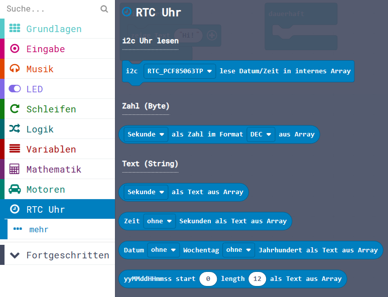

Diese Seite bei [https://calliope-net.github.io/rtc-pcf85063tp/](https://calliope-net.github.io/rtc-pcf85063tp/) öffnen.

### Calliope Erweiterung für das i2c Modul:

* [Grove - High Precision RTC (Real Time Clock)](https://wiki.seeedstudio.com/Grove_High_Precision_RTC/)

Dieses Repository kann als **Erweiterung** in MakeCode hinzugefügt werden.

* öffne [makecode.calliope.cc](https://makecode.calliope.cc)
* klicke auf eine Projektvorlage
* klicke unter dem Zahnrad-Menü auf **Erweiterungen** (oder bei den Blöcken ganz unten)
* kopiere die folgende **Projekt-URL** in die Zwischenablage (Strg-C)
* **calliope-net/rtc-pcf85063tp**
* füge sie auf der Webseite oben ein (Strg-V) und klicke auf die Lupe (oder ENTER)

* zuletzt noch auf das Rechteck klicken - jetzt hat die Liste einen neuen Eintrag bekommen

### Beschreibung der Erweiterung für 'Grove - High Precision RTC (Real Time Clock)'

*

### Erweiterungen

> [Upates für Erweiterungen; Erweiterungen aus einem Projekt löschen.](https://calliope-net.github.io/i2c-test#updates)

> [Alle i2c-Erweiterungen für MakeCode von calliope-net (Software).](https://calliope-net.github.io/i2c-test#erweiterungen)

#### Calliope-Apps, .hex-Dateien, Bildschirmfotos mit Blöcken

> [Alle Beispiel-Projekte für MakeCode von calliope-net (Calliope-Apps).](https://calliope-net.github.io/i2c-test#programmierbeispiele)

> GitHub-Profil calliope-net: [https://github.com/calliope-net](https://github.com/calliope-net)

### Bezugsquellen

> [Alle i2c-Module und Bezugsquellen (Hardware).](https://calliope-net.github.io/i2c-test#bezugsquellen)

#### Metadaten (verwendet für Suche, Rendering)

* Calliope mini
* i2c
